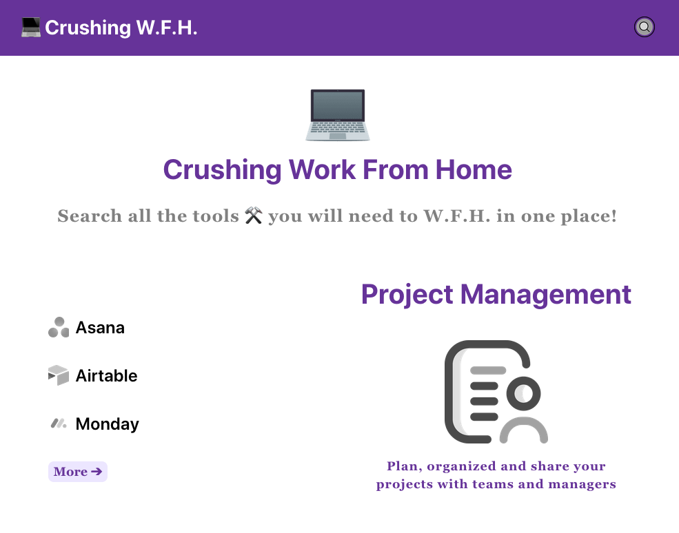
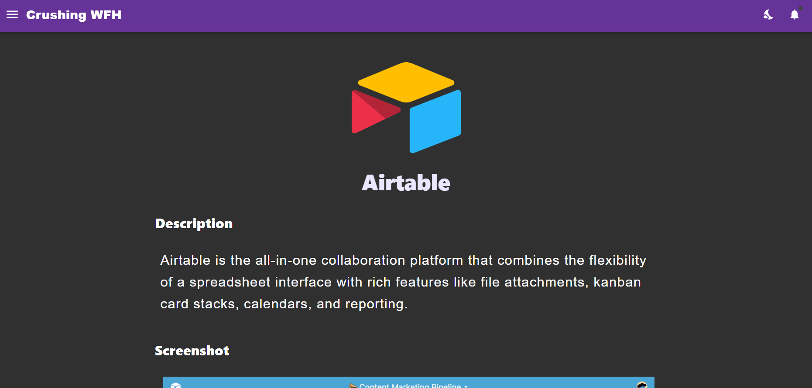
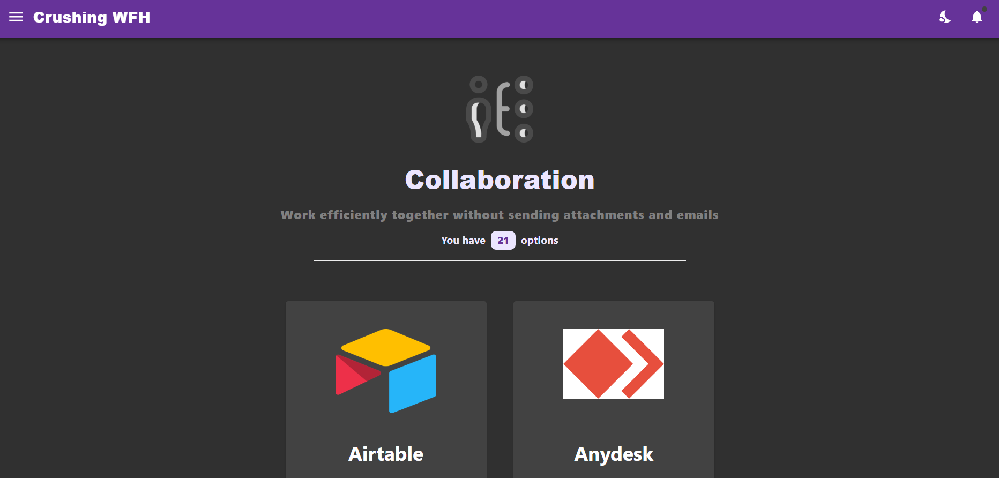
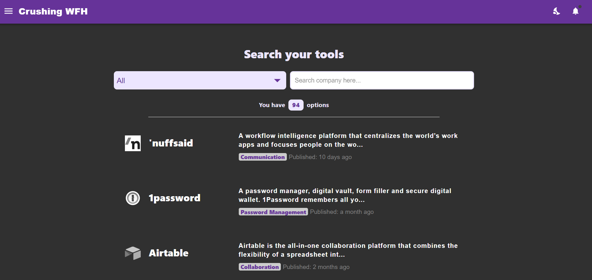
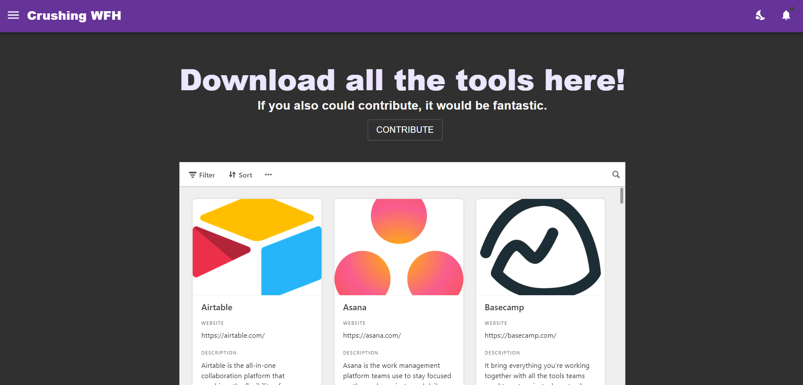

# Tools that make working 💻 from Home a breeze

## About the project

[crushingwfh](https://crushingwfh.com/) is a web app build with Gatsby, leveraging Airtable as a CMS and Netlify for deployment.
This app is a searchable database of tools that help anyone to better work from home.

If you want to contribute: Feel free to reach out if you have any feedback around (1) 🔘 User interface and experience, (2) ⚒️ New apps and tools that you would like to see there and (3) 🚀 any suggestions to improve 💻 [crushingwfh](https://crushingwfh.com/)

## Screenshots

### Home Page
You will be able to find the different type of companies available

### Company Page
Here you will have the details about the company itself

### Company Types Page
All the company organized by the Type

### Search Page
Where you will be able to search for all the tools

### Download Page
Yup, you actually can download all the tools.

